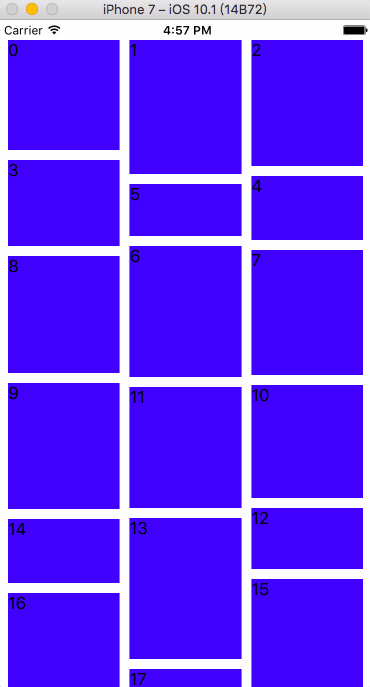

# HLWaterfall
This is an example of a waterfall stream implemented using Swift3.0

## The Effect


## How to use
1.Download the Demo

2.Drag the `HLWaterfallLayout.swift` file to your project

3.Create `HLWaterfallLayout` instance and set `waterfallDataSource`

```swift
let layout = HLWaterfallLayout()
layout.waterfallDataSource = self
let collectionView = UICollectionView(frame: self.view.bounds, collectionViewLayout: layout)
...
```

4.implement the dataSource method

```swift
// MARK: - HLWaterfallLayoutDataSource
extension ViewController: HLWaterfallLayoutDataSource {
    func numberOfCols(_ waterfallLayout: HLWaterfallLayout) -> Int {
        return 3
    }
    func waterfallLayout(_ waterfallLayout: HLWaterfallLayout, heightOfItem item: Int) -> CGFloat {
        return CGFloat(arc4random_uniform(100)) + 50.0
    }
}
```

